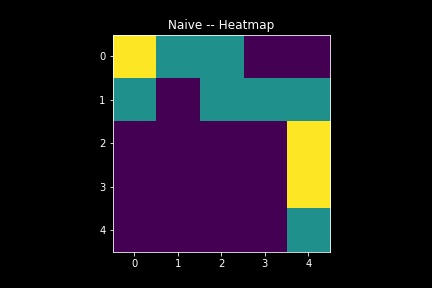
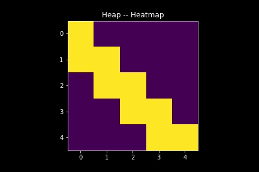

## Agent Fun Project

A fun project for learning purposes. 

## Agents
In this notebook, I built two agents.

Namely, Heap and Naive Agent.

The goal for these two agents is to start from a given state and through a sequence of moves they end up in a goal state. 

### Enviroment
The enviroment is a 2D plane that has start and goal state. 
Once the agent makes a move the grid changes it state according to the move made by the agent. 

### Algorithms:

### Naive:
The Naive agent is a simple algorthim that gets all possible moves and randomly picks a move out of all avaliable moves according to a uniform distribution.

### Heap:
The Heap agent is a slighly smarter agent it picks its next move that minimizes the manhatan distance between the move and the goal state.

### Conclusion:
The Heatmap shows the number of moves the agent visited that cell *(The higher the worse the agent performed)*. 

We notice that the heap agent performed optimally in the enviroment, were the naive agent spent more time.

#### Naive Agent:

Heatmap Naive Agent:

#### Heap Agent:

Heatmap Heap Agent:

